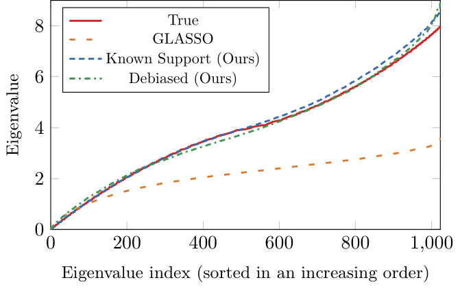

# GMRF-MM

Repository for our paper [Effective Learning of a GMRF Mixture Model](https://ieeexplore.ieee.org/abstract/document/9676590)

## Using the code
`GMRF` folder contains the single-gaussian estimators (including our implementation of GLASSO).  
`MixtureModel` folder contains our EM-GMM implementation with an option to set the inverse-covariance estimator (`set_Q_estimator`).

### Single Gaussian Example
`DemoDebias.py` recreates experiment A (of smaller dimension).  


### Mixture Model Example
`DemoClustering.py` recreates experiment B (of smaller dimension).  
  

## Copyright and License
This software is released under the MIT License (included with the software). Note, however, that if you are using this code (and/or the results of running it) to support any form of publication (e.g., a book, a journal paper, a conference paper, a patent application, etc.) then we request you will cite our paper:
```
@article{finder2022effective,
  title={Effective Learning of a GMRF Mixture Model},
  author={Finder, Shahaf E and Treister, Eran and Freifeld, Oren},
  journal={IEEE Access},
  year={2022},
  publisher={IEEE}
}
```
